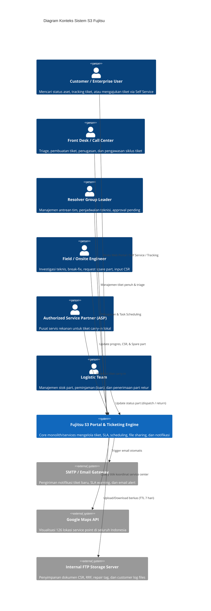
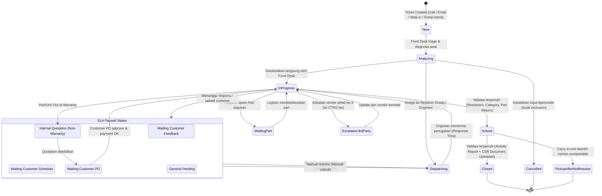
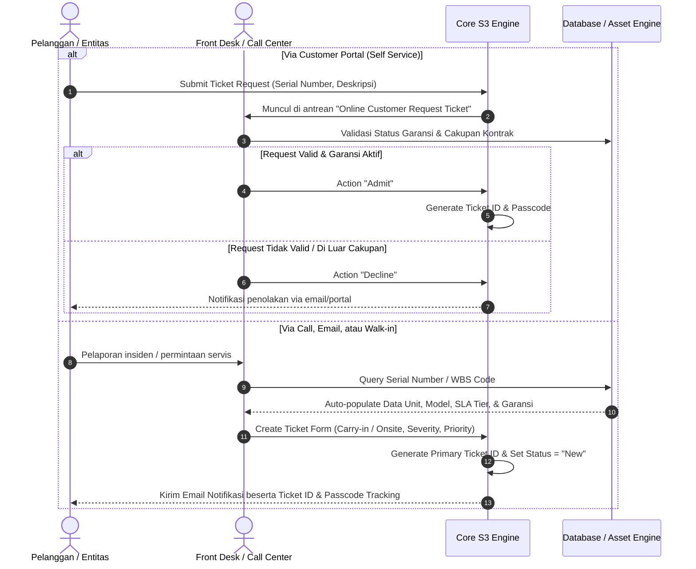
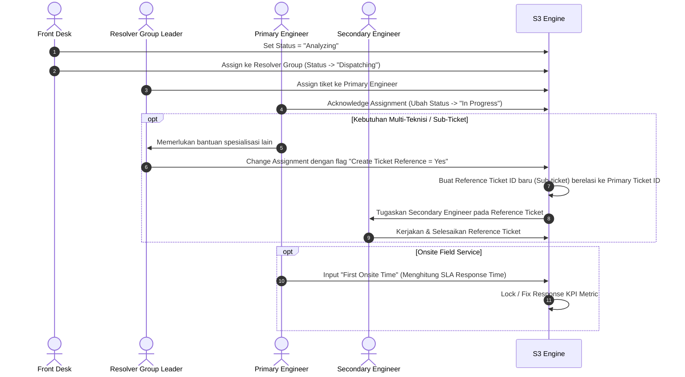
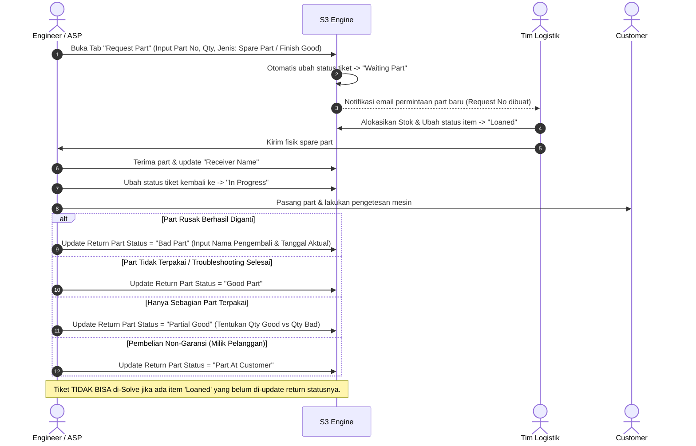
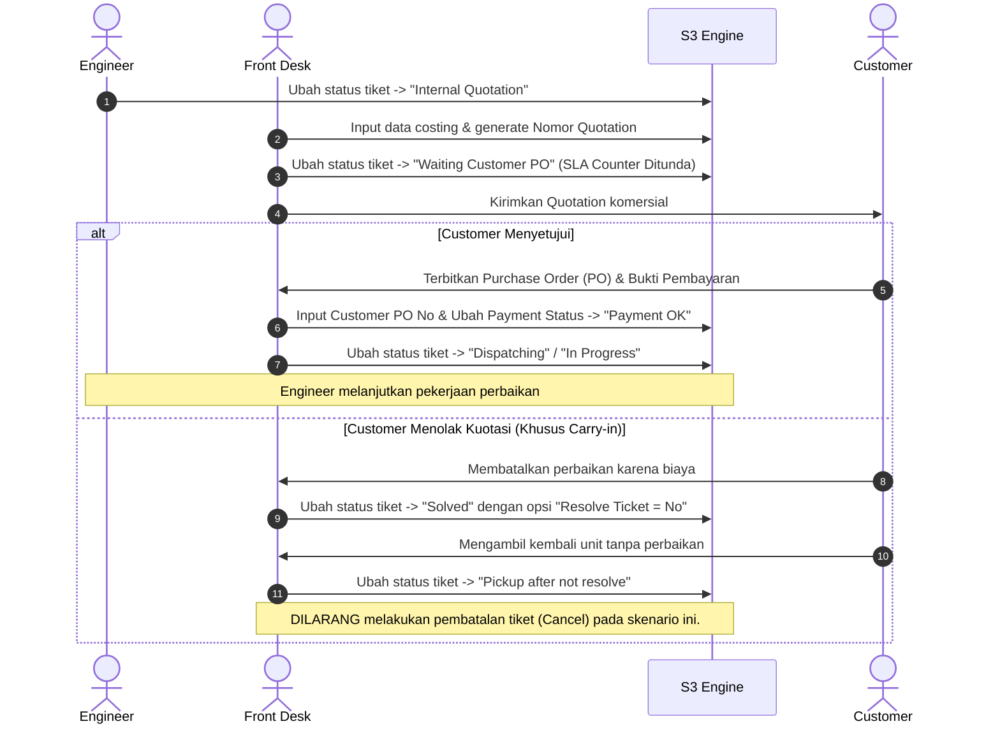
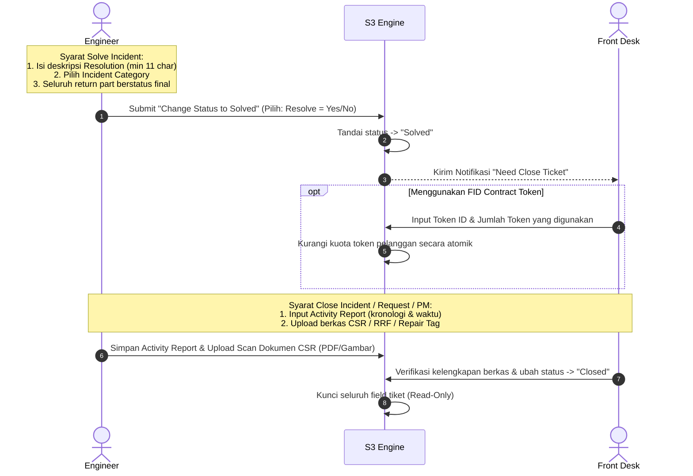
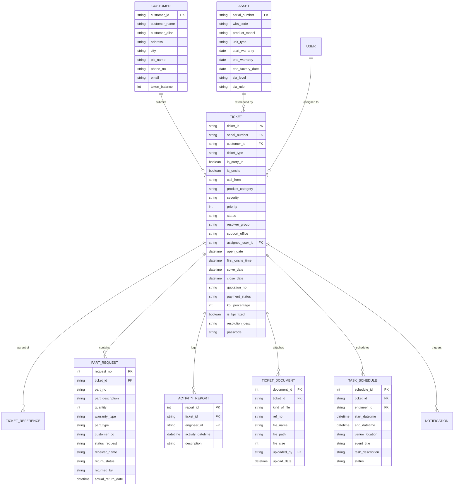

# Spesifikasi Arsitektur Sistem & Alur Bisnis (System Flow)
## Fujitsu Support Service System Portal (S3) Ticketing System

Dokumen ini ditujukan bagi **System Architect**, **Tech Lead**, dan **Backend Engineer** untuk memahami topologi domain, alur kerja antar-entitas, mesin status (*state machine*), aturan validasi SLA/KPI, serta dependensi sub-modul pada sistem S3 Ticketing.

---

## 1. Ringkasan Eksekutif & Topologi Sistem

S3 (*Support Service System*) adalah platform manajemen layanan purnajual (*after-sales support*) perangkat keras dan infrastruktur IT Fujitsu di Indonesia. Sistem ini mencakup layanan pelanggan (*customer-facing*), operasional *helpdesk/front-desk*, penjadwalan *engineer* lapangan, logistik suku cadang (*spare parts*), dan penagihan/kuotasi non-garansi.

### 1.1 Diagram Konteks Sistem (C4 Context Level)



---

## 2. Matriks Akses & Kewenangan Berbasis Peran (RBAC Matrix)

Sistem membedakan hak akses berdasarkan peran operasional (*Role-Based Access Control*):

| Kapabilitas / Fitur | Front Desk / Call Center | Resolver Group Leader | Field Engineer | Authorized Service Partner (ASP) | Enterprise Customer |
| :--- | :---: | :---: | :---: | :---: | :---: |
| **Create Ticket (Carry-in / Non-Carry-in)** |  Penuh | ❌ | ❌ |  Hanya Carry-in | ❌ (Submit Request Only) |
| **Admit / Decline Customer Request** |  Penuh | ❌ | ❌ | ❌ | ❌ |
| **Change Status: In Progress / Escalation**|  |  |  |  | ❌ |
| **Change Assignment (Reassign)** |  |  | ❌ | ❌ (Coordinator Only) | ❌ |
| **Set Ticket to Pending / Stop SLA** |  |  | ❌ (Perlu Eskalasi) | ❌ (Request ke Leader) | ❌ |
| **Request Spare Part** |  |  |  |  | ❌ |
| **Update Return Part Status** |  |  |  |  | ❌ |
| **Input Activity Report & CSR Upload** |  |  |  (Mandatori) |  (Mandatori) | ❌ |
| **Solve Ticket** |  |  |  |  | ❌ |
| **Close / Cancel Ticket** |  (Penuh) | ❌ | ❌ | ❌ | ❌ |
| **Task Scheduling Management** | ❌ |  (All Members) |  (Own Schedule) | ❌ | ❌ |

---

## 3. Diagram Mesin Status Tiket (Ticket State Machine)

Siklus hidup tiket diatur melalui 15 status operasional yang mengontrol alur proses dan penghitungan SLA/KPI.



---

## 4. End-to-End Business Flow & Sequence Diagrams

### 4.1 Alur Ingesti Tiket & Triage (Incoming Call, Email, & Portal)

Setiap interaksi pelanggan tunduk pada aturan ketat: **"One Call, One Ticket"**.



### 4.2 Alur Penugasan & Eskalasi Teknis (Incident & Multi-Engineer Reference)

Ketika tiket membutuhkan penanganan lapangan atau melibatkan lebih dari satu tim resolver:



### 4.3 Alur Siklus Peminjaman & Pengembalian Suku Cadang (Spare Part Lifecycle)

Penggantian suku cadang hanya diperbolehkan untuk tiket bertipe *Hardware*.



### 4.4 Alur Non-Garansi & Kuotasi Komersial (Quotation & PO Gate)

Jika unit perangkat keras teridentifikasi berada di luar masa garansi (*Out of Warranty*):



### 4.5 Alur Penutupan Tiket & Konsumsi Token Kontrak (Resolution & Closure Gate)



---

## 5. Mesin Aturan SLA, Perhitungan KPI, & Validasi Sistem

### 5.1 Definisi Tingkat SLA (SLA Tiers)

1. **Gold SLA**: Komitmen waktu respons *onsite* $\le 4\text{ jam}$, beroperasi penuh $24/7$.
2. **Standard SLA**: Komitmen waktu respons *onsite* hari kerja berikutnya (*Next Business Day* - NBD), jadwal $8/5$.
3. **Carry-in SLA**: Tidak ada komitmen resolusi onsite; batas standar penyelesaian di *service point* adalah $7\text{ hari kerja}$.
4. **Non-Warranty Ticket**: Tidak ada komitmen SLA resmi; target *best-effort* internal sistem diset default $30\text{ hari kerja}$.
5. **Other Standard Contracts**: Target resolusi sistem default diset $14\text{ hari kerja}$.

### 5.2 Logika Perhitungan KPI (KPI Calculation Rules)

KPI diukur berdasarkan rasio konsumsi waktu terhadap ambang batas komitmen:

$$KPI_{\text{persen}} = \left( \frac{\text{Waktu Aktual Konsumsi}}{\text{Target SLA Durasi}} \right) \times 100\%$$

* **Status Ketercapaian SLA**: Tiket dinyatakan **Meet SLA** jika nilai $KPI \le 100\%$. Sebaliknya, jika $KPI > 100\%$, tiket diklasifikasikan sebagai **Miss SLA**.
* **Mekanisme KPI Fixed (Penguncian Perhitungan)**:
  * **FID Rule (Non Carry-in)**: Nilai KPI dikunci permanen (*Fixed*) saat nilai `First Onsite Time` diinput ke dalam sistem.
  * **FID Rule (Carry-in)**: Nilai KPI dikunci permanen saat tiket mencapai status `Solved`.
  * **RESOLVE Rule (Custom SLA)**: Nilai KPI dikunci permanen saat status tiket menjadi `Solved`.
* **Mekanisme KPI Paused (Jeda Waktu)**:
  Penghitungan durasi SLA otomatis dihentikan (*paused*) saat tiket berada pada status:
  1. `Waiting Customer PO`
  2. `Waiting Customer Feedback`
  3. `Waiting Customer Schedule`
  4. `Pending`

Setiap transisi ke status jeda **wajib** mencantumkan atribut `Target End Date`. Apabila batas waktu *target end date* terlampaui dan belum ada pembaruan manual, *background worker* sistem akan secara otomatis mengembalikan status tiket ke `Dispatching`.

### 5.3 Matriks Validasi Gate Status (Quality Gates)

Sistem memberlakukan guard validation sebelum mengizinkan mutasi status:

```text
+-------------------+--------------------------------------------------------------------------+
| Target Status     | Syarat Validasi Sistem (Pre-conditions)                                 |
+-------------------+--------------------------------------------------------------------------+
| Solved (Incident) | 1. Field 'Resolution' terisi (panjang karakter >= 11 karakter).          |
|                   | 2. Minimal 1 'Incident Category' dipilih.                                |
|                   | 3. Semua item Request Part telah berstatus final (Bukan 'Loaned').       |
|                   | 4. User wajib memilih flag 'Resolve Ticket' (Yes / No).                  |
+-------------------+--------------------------------------------------------------------------+
| Solved (Request)  | 1. Field 'Resolution' terisi (panjang karakter >= 11 karakter).          |
|                   | 2. Semua item Request Part telah berstatus final (Bukan 'Loaned').       |
+-------------------+--------------------------------------------------------------------------+
| Solved (PM)       | 1. Field 'Resolution' terisi.                                            |
+-------------------+--------------------------------------------------------------------------+
| Solved (Inquiry)  | Tanpa prasyarat tambahan (dapat langsung di-solve setelah 'Analyzing'). |
+-------------------+--------------------------------------------------------------------------+
| Closed            | 1. Record 'Activity Report' wajib terisi lengkap.                        |
|                   | 2. File lampiran wajib diunggah: Dokumen CSR (Customer Service Report)    |
|                   |    atau RRF (Return Receive Form) untuk carry-in.                        |
|                   |    Jika tipe unit Server/Storage: File 'Repair Tag' wajib disertakan.   |
+-------------------+--------------------------------------------------------------------------+
| Cancelled         | Hanya diperbolehkan jika berasal dari status 'Analyzing' DAN disebabkan  |
|                   | oleh kesalahan input struktural:                                         |
|                   | - Salah memilih jenis Carry-in (Yes/No).                                 |
|                   | - Salah memilih Ticket Type.                                             |
|                   | - Salah memilih flag Onsite Support.                                     |
|                   | (Tiket yang di-cancel dieksklusikan dari kalkulasi performa bulanan).    |
+-------------------+--------------------------------------------------------------------------+
```

---

## 6. Desain Entitas Data Utama (Data Entity Relationship)

Struktur skema relasional utama yang menyokong alur sistem ticketing S3:



---

## 7. Arsitektur Subsistem Pendukung (Sub-modules)

### 7.1 Subsistem Penjadwalan Teknisi (Task Scheduler)
* **Tujuan**: Mencegah tabrakan jadwal teknisi lapangan (*prevent double-booking*) dan memvisualisasikan ketersediaan teknisi untuk Front Desk dan Resolver Leader saat proses penugasan.
* **Fitur Utama**:
  * Filter kalender mingguan per Resolver Group.
  * Penandaan status jadwal (*Active* vs *Inactive*).
  * Relasi mandatory terhadap `Ticket ID`.
  * Pembatasan izin edit berbasis penanda pin (pin merah dapat diedit, pin abu-abu terkunci/read-only).

### 7.2 Layanan Berbagi Berkas FTP (FTP Storage Service)
* Digunakan untuk pertukaran berkas berukuran besar seperti log kerusakan sistem pelanggan dan buku panduan manual perbaikan.
* **Spesifikasi & Limitasi**:
  * Batas maksimum unggahan default: $75\text{ MB}$ per berkas.
  * Tautan unduhan (*download link share*) memiliki masa kedaluwarsa otomatis (**TTL**): $7\text{ hari}$.
  * Berkas sumber tetap tersimpan permanen di direktori server penyimpanan meskipun tautan publik telah kedaluwarsa.

### 7.3 Mesin Notifikasi & Task Queue (Notification Engine)
Sistem memiliki *in-app notification generator* yang memetakan item aksi langsung ke *dashboard* masing-masing pengguna berdasarkan perubahan status tiket:
* `Need Response`: Dipicu saat tiket baru dibuat dan menuntut respons awal.
* `Need Assignment`: Dipicu saat status tiket berada di fase `Analyzing` untuk segera ditugaskan ke *resolver group*.
* `Need Close Ticket`: Dipicu saat status tiket telah `Solved` dan menunggu dokumen CSR serta laporan aktivitas diunggah.

---

## 8. Catatan Arsitektur & Rekomendasi Modernisasi (Architect's Advisory)

Bagi tim arsitek yang merancang ulang (*re-architecting*) sistem S3 ke arsitektur modern (misal: Microservices atau Modular Monolith):

1. **State Machine Decoupling**: Pisahkan 15 status tiket ke dalam mesin status formal (seperti *Spring State Machine*, *Stateless*, atau *Temporal/Workflow Orchestrator*) agar validasi transisi tidak tersebar di banyak *controller logic*.
2. **SLA Calculation Worker**: Hindari kalkulasi persentase KPI secara sinkron saat kueri halaman (*on-the-fly request*). Gunakan *asynchronous distributed worker* (misal: Celery, BullMQ, atau Kafka consumers) untuk memperbarui konsumsi waktu dan mendeteksi kondisi kedaluwarsa *Target End Date* pada status *Pending*.
3. **Optimistic Locking untuk Part Inventory**: Pada modul `Request Part`, pastikan alokasi stok suku cadang menggunakan transaksi *database lock* untuk mencegah *race condition* atas nomor part yang sama.
4. **Audit Trail Immutability**: Pisahkan histori mutasi tiket, riwayat penugasan, dan perubahan status pengembalian part ke tabel *audit event log* terpisah yang bersifat *append-only*.